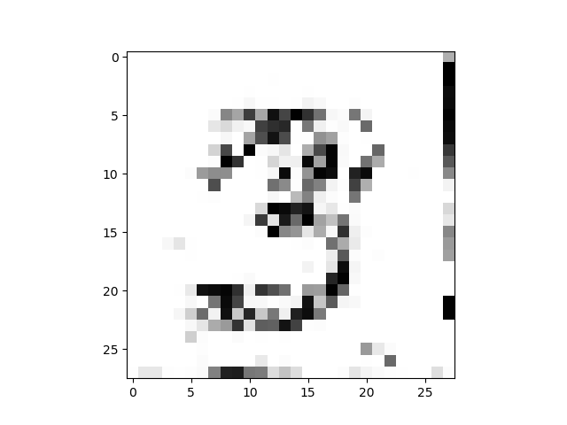

# python3-Simple_cGAN_with_MNIST
>It's just a simple implementation of cGAN

It's a simple cGAN implementation which is based on [Yi-Hsiang Kao](https://medium.com/@gau820827/%E6%95%99%E9%9B%BB%E8%85%A6%E7%95%AB%E7%95%AB-%E5%88%9D%E5%BF%83%E8%80%85%E7%9A%84%E7%94%9F%E6%88%90%E5%BC%8F%E5%B0%8D%E6%8A%97%E7%B6%B2%E8%B7%AF-gan-%E5%85%A5%E9%96%80%E7%AD%86%E8%A8%98-tensorflow-python3-dfad71662952) and [jonbruner](https://github.com/jonbruner/generative-adversarial-networks).



## Requirements

* python 3
* NumPy
* matplotlib
* TensorFlow version 1.0 or later

## Usage example

Training:

```sh
python train.py
```

Testing:

```sh
python test.py
```
